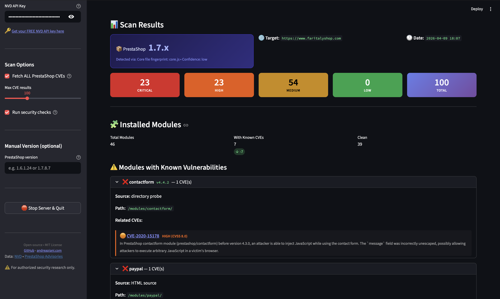

<div align="center">

# 🛡️ PyPrestaSec

### PrestaShop Vulnerability Scanner

**All-in-one security assessment tool for PrestaShop websites**

[](https://python.org)
[](https://streamlit.io)
[](LICENSE)
[](https://nvd.nist.gov)

---



</div>

---

## What is PyPrestaSec?

PyPrestaSec is an open-source security scanner built specifically for **PrestaShop** e-commerce sites. It detects the installed version, discovers modules, looks up known CVEs from the NVD database, checks HTTP security headers, validates SSL/TLS, probes for exposed admin panels, and generates **professional PDF reports** you can hand directly to your client.

---

## ✨ Features

| Feature | Description |
|---------|-------------|
| 🔍 **Version Detection** | 11 detection methods — meta tags, HTTP headers, JS fingerprints, asset versioning, jQuery fingerprint, robots.txt, config probing, and more |
| 🧩 **Module Discovery** | Detects 65+ installed modules via HTML analysis and directory probing, with version extraction |
| � **Version Refinement** | Cross-references detected module versions against known PS release bundles to refine approximate versions (e.g. 1.7.x → 1.7.8.8) |
| � **CVE Lookup** | Fetches all known PrestaShop vulnerabilities from the NVD API, matches CVEs to detected modules |
| 🌐 **HTTP Headers** | Checks HSTS, CSP, X-Frame-Options, X-Content-Type-Options, Referrer-Policy, Permissions-Policy |
| 🔐 **SSL/TLS Check** | Validates certificate, protocol version, expiry date, issuer |
| 🚪 **Admin Panel Detection** | Probes 13 common admin paths to detect exposed login pages |
| 📊 **Risk Score (A–F)** | Aggregated 0–100 security score with detailed breakdown |
| 📄 **PDF Report** | Professional, client-ready vulnerability report with all findings |
| 💾 **JSON & CSV Export** | Machine-readable exports for integration with other tools |
| 📟 **Live Scan Logs** | Real-time progress console visible during scanning |
| 🎯 **Manual Version** | Override auto-detection if the site hides version info |

---

## 🚀 Quick Start

### 1. Clone & Install

```bash
git clone https://github.com/andreapianidev/pyprestasec.git
cd pyprestasec
```

```bash
# Create virtual environment (recommended)
python3 -m venv venv
source venv/bin/activate        # macOS / Linux
# venv\Scripts\activate         # Windows
```

```bash
# Install dependencies
pip install -r requirements.txt
```

### 2. Get a Free NVD API Key _(recommended)_

An API key gives you **10x faster scans** (50 req/30s vs 5 req/30s).

1. Go to **[nvd.nist.gov/developers/request-an-api-key](https://nvd.nist.gov/developers/request-an-api-key)**
2. Fill the form — it's **instant and free**
3. Create your `.env` file:

```bash
cp .env.example .env
```

4. Paste your key inside:

```
NVD_API_KEY=your_api_key_here
```

> **Note:** The scanner works without an API key too — just with slower NVD rate limits.

### 3. Run

```bash
streamlit run ui/app.py
```

Open **[http://localhost:8501](http://localhost:8501)** in your browser. That's it!

---

## 📖 How to Use

1. **Enter the target URL** — e.g. `https://shop.example.com`
2. **Configure** in the sidebar:
   - Paste your **NVD API key** (or [get one free](https://nvd.nist.gov/developers/request-an-api-key))
   - Set **Max CVE results** (20–300)
   - Toggle **security checks** (headers, SSL, admin panel)
   - Enter a **manual version** if auto-detection fails
3. Click **🔍 Scan** and watch the **live log console**
4. Review results:
   - **Version card** — detected version, source, confidence level
   - **Installed modules** — with CVE matching per module
   - **Severity breakdown** — Critical / High / Medium / Low
   - **Security Assessment** — risk grade A–F with score breakdown
   - **CVE list** — filterable, searchable, sortable
5. **Export** as **PDF**, **JSON**, or **CSV**

---

## 🏗️ Project Structure

```
pyprestasec/
├── src/
│   ├── scanner.py              # Main scan orchestration
│   ├── version_detector.py     # 11-method version detection + module cross-reference
│   ├── module_detector.py      # Module discovery & version extraction
│   ├── cve_api.py              # NVD API client with pagination
│   ├── security_checks.py      # Headers, SSL, admin panel, risk score
│   ├── report.py               # PDF, JSON, CSV report generation
│   ├── models.py               # Data models
│   └── config.py               # Configuration & env loading
├── ui/
│   └── app.py                  # Streamlit web interface
├── docs/
│   └── pyprestasec.png        # UI screenshot
├── requirements.txt
├── .env.example
├── LICENSE
└── README.md
```

---

## 🔌 Programmatic Usage

```python
from src.scanner import PrestaShopScanner
from src.report import generate_pdf

scanner = PrestaShopScanner(api_key="your_key")
result = scanner.scan("https://shop.example.com")

# Version & CVEs
print(f"Version: {result.detected_version.version}")
print(f"CVEs: {result.total_cves} (Critical: {result.critical_count})")
print(f"Modules: {len(result.detected_modules)}")
print(f"Risk Grade: {result.security_report.risk_score}")

# Generate PDF report
with open("report.pdf", "wb") as f:
    f.write(generate_pdf(result))
```

---

## 📋 Supported Versions

| Version | Status |
|---------|--------|
| PrestaShop **1.6.x** | ✅ Supported |
| PrestaShop **1.7.x** | ✅ Supported |
| PrestaShop **8.x** | ✅ Supported |

> Detection accuracy depends on the target site's configuration. Some sites hide version information — use the manual input in that case.

---

## 🤝 Contributing — Contributors Wanted!

We're actively looking for contributors to help make PyPrestaSec the **#1 open-source PrestaShop security tool**. Whether you're a security researcher, a PrestaShop developer, or just passionate about open source — **your help is welcome!**

Here's how you can contribute:

- ⭐ **Star** this repo to support the project and help it grow
- 🐛 **Report bugs** or suggest features via [Issues](https://github.com/andreapianidev/pyprestasec/issues)
- � **Submit a PR** — bug fixes, new detection methods, UI improvements, anything goes!
- 🧩 **Expand the module database** — add more PrestaShop modules to the detection and fingerprint lists
- 🌍 **Translations** — help localize the UI or exported reports
- 📖 **Documentation** — improve guides, write tutorials, add usage examples
- � **Security research** — contribute new CVE mappings, version fingerprints, or detection techniques

> **First time contributing?** Look for issues labeled [`good first issue`](https://github.com/andreapianidev/pyprestasec/labels/good%20first%20issue) to get started!

---

## ⚠️ Disclaimer

> **This tool is intended for authorized security research and testing only.**
>
> - Always obtain proper authorization before scanning websites you don't own
> - Respect rate limits and terms of service of all APIs
> - The tool is provided as-is, without warranties of any kind

---

## 📄 License

Open-source under the **MIT License** — see [LICENSE](LICENSE) for details.

---

<div align="center">

### 👤 Author

**Andrea Piani**

[](https://www.andreapiani.com)
[](mailto:andreapiani.dev@gmail.com)
[](https://github.com/andreapianidev)

---

**[Get Free NVD API Key](https://nvd.nist.gov/developers/request-an-api-key)** · **[NVD Documentation](https://nvd.nist.gov/developers)** · **[PrestaShop Advisories](https://build.prestashop-project.org/news/tags/security/)**

</div>
